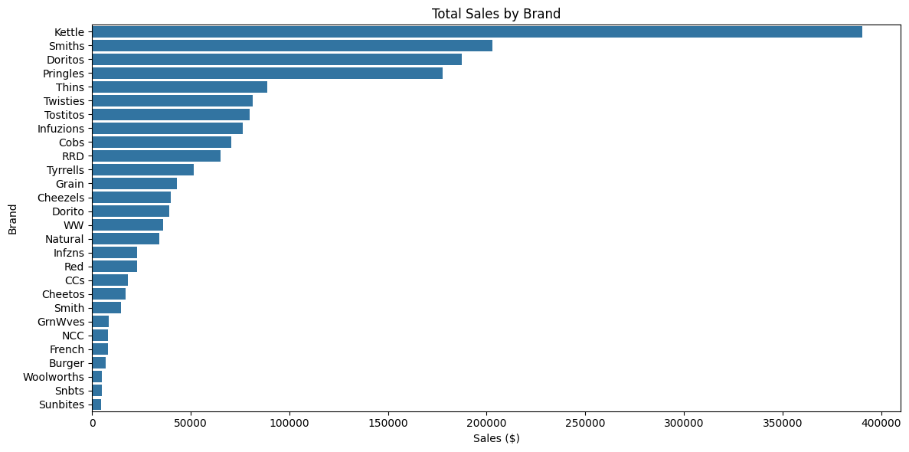
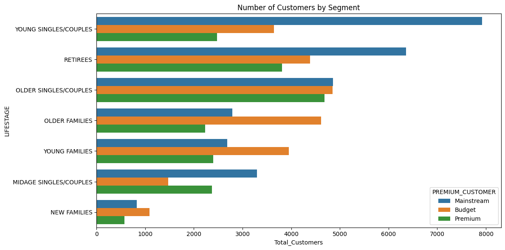
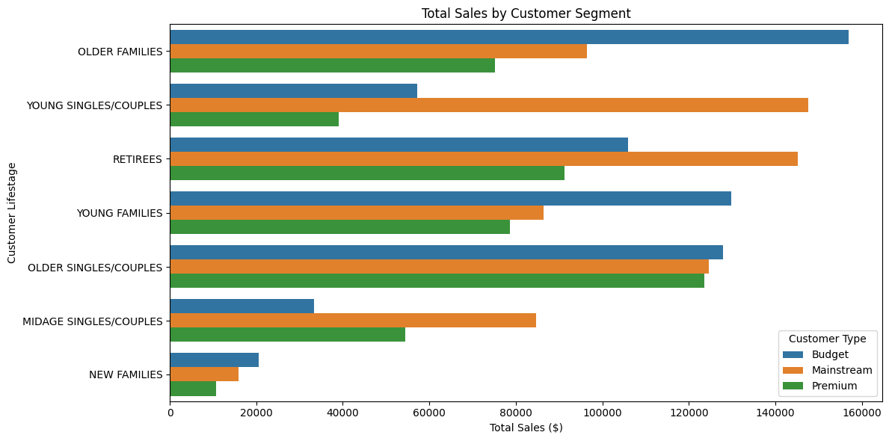
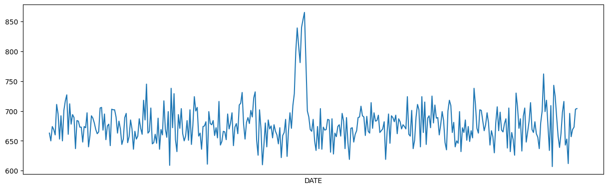
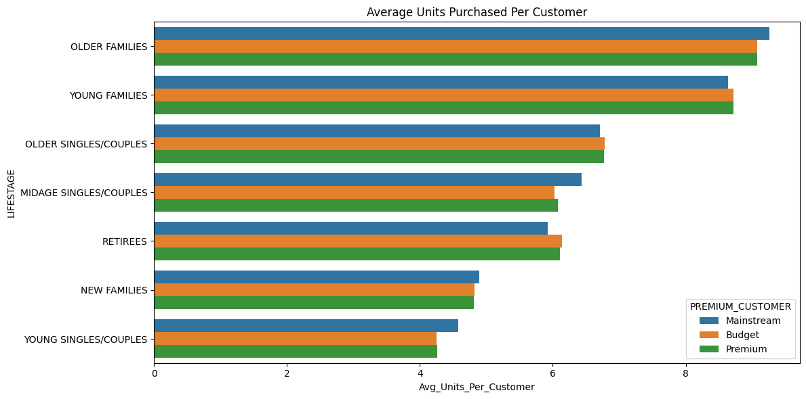
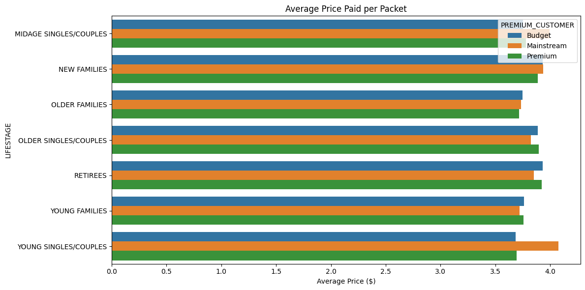
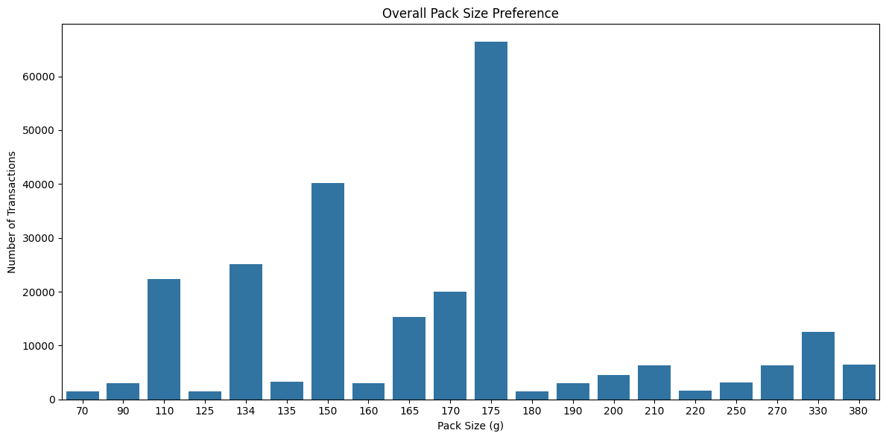
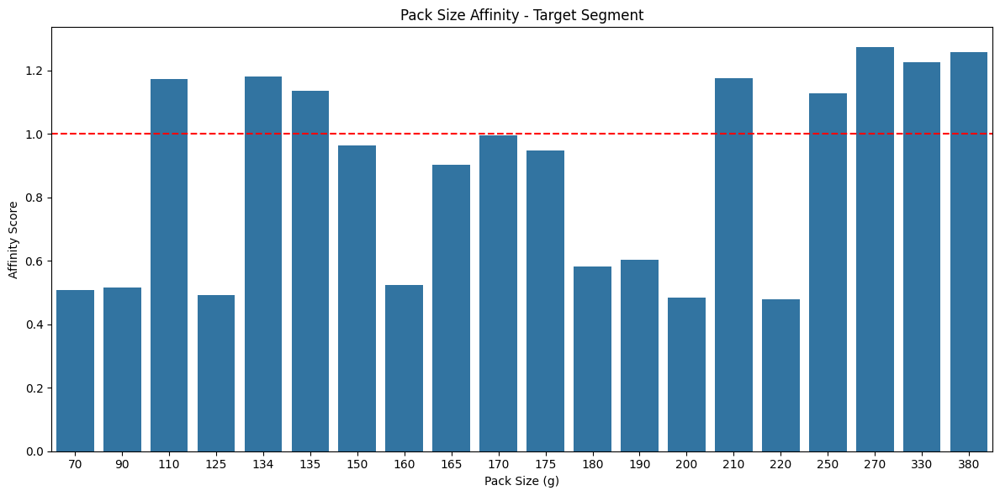

<div align="center">

# 📊 Quantium Retail Analytics

### Retail Customer Analytics | Customer Segmentation | Business Intelligence | Python


</div>

---

<p align="center">


</p>

---

# 🚀 Project Overview

This project is part of the **Quantium Retail Analytics Virtual Experience Program**.

The objective is to analyze customer purchasing behaviour within the Chips category and identify high-value customer segments that can drive future business growth.

The project includes:

- Data Cleaning
- Customer Analytics
- Exploratory Data Analysis
- Customer Segmentation
- Brand Analysis
- Pack Size Analysis
- Business Recommendations
- Statistical Testing

---

# 🎯 Business Objective

Quantium's Category Manager wants to answer questions like:

✔ Which customers purchase the most chips?

✔ Which customer segments generate the highest revenue?

✔ Which chip brands are preferred?

✔ Which pack sizes sell the most?

✔ Which customer segment should be targeted for future marketing campaigns?

---

# ⚙️ Tech Stack

| Category | Technology |
|----------|------------|
| Language | Python |
| Notebook | Google Colab |
| Data Processing | Pandas |
| Numerical Computing | NumPy |
| Visualization | Matplotlib |
| Statistical Analysis | SciPy |
| Dataset | Excel + CSV |

---

# 📂 Project Structure

```text
Quantium-Retail-Analytics
│
├── Cleaned_Data
│
├── Data
│
├── Report
│
├── Scripts
│
├── visualizations
│
├── README.md
│
└── requirements.txt
```

---

# 📁 Cleaned Data

The **Cleaned_Data** folder contains processed analytical datasets.

| File | Description |
|------|-------------|
| average_price.csv | Average price paid by each customer segment |
| average_units.csv | Average units purchased per customer |
| brand_affinity.csv | Brand preference analysis |
| brand_sales.csv | Brand-wise sales summary |
| customer_clean.csv | Cleaned customer dataset |
| customer_segment.csv | Customer segmentation summary |
| final_merged_data.csv | Final merged analytical dataset |
| pack_affinity.csv | Preferred pack sizes |
| pack_sales.csv | Pack size sales |
| sales_segment.csv | Sales by customer segment |
| target_brand.csv | Target customer brand analysis |
| transaction_clean.csv | Cleaned transaction dataset |

---

# 📊 Visualizations
---

# 📊 Exploratory Data Analysis (EDA)

A comprehensive exploratory data analysis was conducted to understand customer purchasing behavior, identify data quality issues, and uncover meaningful business insights.

## ✔ Data Preparation

The following preprocessing steps were completed before analysis:

- ✔ Removed non-chip products (e.g., Salsa products)
- ✔ Converted Excel serial dates to proper datetime format
- ✔ Removed extreme outlier transactions
- ✔ Checked missing values
- ✔ Checked duplicate records
- ✔ Merged customer and transaction datasets
- ✔ Extracted **Brand Name**
- ✔ Extracted **Pack Size**
- ✔ Calculated additional analytical metrics

---

# 📈 Key Performance Indicators

| KPI | Description |
|------|-------------|
| 💰 Total Sales | Revenue generated from chip sales |
| 🛒 Total Transactions | Number of completed transactions |
| 👥 Unique Customers | Total loyalty customers |
| 📦 Average Units Purchased | Average packets bought per transaction |
| 💵 Average Price per Pack | Average selling price |
| 🏷️ Brand Preference | Most preferred chip brands |
| 📦 Pack Size Preference | Most purchased pack sizes |
| 🎯 High Value Segments | Customer groups generating maximum revenue |

---

# 📉 Visual Analytics

## 💰 Total Sales



### Insights

- Overall sales demonstrate healthy customer demand.
- Revenue is primarily driven by repeat customers.
- Strong contribution from family-oriented customer segments.

---

## 👥 Customer Segments



### Insights

- Customer distribution varies significantly by life stage.
- Mainstream customers form the largest customer base.
- Family households represent an important market segment.

---

## 📊 Sales by Customer Segment



### Business Insights

✔ Budget Older Families generate one of the highest sales.

✔ Mainstream Young Singles/Couples contribute significant revenue.

✔ Mainstream Retirees remain valuable repeat customers.

These customer groups should receive targeted promotional campaigns.

---

## 📈 Daily Sales Trend



### Insights

- Sales remain relatively stable over time.
- No abnormal fluctuations after cleaning.
- Consistent customer purchasing behavior indicates a healthy product category.

---

## 📦 Average Units Purchased



### Insights

Family-based customer segments purchase:

- More packets per shopping trip
- Larger basket sizes
- Higher total quantity

Older Families consistently purchase more units than Singles.

---

## 💵 Average Pack Price



### Insights

Mainstream Young & Mid-age Singles/Couples pay:

- Slightly higher prices
- Lower price sensitivity
- Stronger willingness to purchase premium products

---

## 📦 Pack Size Distribution



### Insights

- Medium-sized packs dominate sales.
- Large packs appeal to family households.
- Smaller packs are preferred by individual shoppers.

---

## 📦 Pack Size Affinity



### Insights

Affinity analysis reveals:

- Target customer segments show strong preference for selected pack sizes.
- Product assortment can be optimized using these purchasing patterns.

---

# 🧠 Customer Segmentation Analysis

Customers were segmented using two important business dimensions:

## 👨‍👩‍👧‍👦 Lifestage

- Young Singles/Couples
- Mid-age Singles/Couples
- Older Singles/Couples
- Young Families
- Older Families
- Retirees
- New Families

---

## 💎 Premium Category

- Budget
- Mainstream
- Premium

---

These segments help explain differences in:

- Spending behavior
- Purchase frequency
- Brand preference
- Product choice
- Revenue contribution

---

# 🏷️ Feature Engineering

Additional business variables were created to improve analytical depth.

## Brand Extraction

Example:

```text
Doritos Cheese Supreme 170g
```

↓

```text
Brand = Doritos
```

---

## Pack Size Extraction

Example:

```text
Doritos Cheese Supreme 170g
```

↓

```text
170g
```

These engineered features enabled advanced analysis of:

- Brand loyalty
- Pack size preference
- Customer affinity
- Product performance

---

# 📌 Major Findings

### ✔ High Revenue Segments

- Budget Older Families
- Mainstream Young Singles/Couples
- Mainstream Retirees

---

### ✔ Higher Quantity Purchases

- Older Families
- Young Families

---

### ✔ Higher Average Price Paid

- Mainstream Young Singles/Couples

---

### ✔ Strong Brand Loyalty

Premium brands receive greater preference among mainstream shoppers.

---

### ✔ Popular Pack Sizes

Medium-sized packs generate the highest demand.

---

---

# 📊 Statistical Analysis

To validate whether customer purchasing behavior differs significantly across customer segments, statistical hypothesis testing was performed.

## Independent Two-Sample T-Test

The average price per packet was compared between:

- 🎯 Mainstream Young & Mid-age Singles/Couples
- 👥 Budget and Premium Young & Mid-age Singles/Couples

### Objective

Determine whether Mainstream customers pay significantly more per packet than other customer groups.

### Null Hypothesis (H₀)

There is **no significant difference** in the average price per packet between the two customer groups.

### Alternative Hypothesis (H₁)

Mainstream Young & Mid-age Singles/Couples pay a **significantly higher average price**.

### Result

The statistical test supports the observation that Mainstream Young & Mid-age Singles/Couples are less price-sensitive and tend to purchase higher-priced chip products.

---

# 💼 Business Recommendations

Based on the analytical findings, the following recommendations are proposed.

## 🎯 Recommendation 1

### Target High-Value Customer Segments

Focus marketing campaigns on:

- Budget Older Families
- Mainstream Young Singles/Couples
- Mainstream Retirees

These customer groups contribute the largest share of total category sales.

---

## 🛒 Recommendation 2

### Optimize Product Assortment

Increase inventory for:

- High-performing brands
- Most purchased pack sizes
- Frequently purchased premium products

This helps reduce stock-outs while maximizing sales.

---

## 🏷 Recommendation 3

### Improve Shelf Placement

Place the best-selling brands in:

- Eye-level shelves
- High-traffic store locations
- Promotional end-cap displays

Improved visibility is expected to increase impulse purchases.

---

## 🎁 Recommendation 4

### Personalized Promotions

Launch targeted offers such as:

- Family Value Packs
- Multi-buy Discounts
- Loyalty Rewards
- Personalized Coupons

These promotions should be customized based on customer purchasing behavior.

---

## 📦 Recommendation 5

### Pack Size Optimization

Maintain higher inventory levels for:

- Medium-sized packs
- Family packs

These pack sizes consistently generate the highest demand.

---

# 📁 Project Outputs

The project generates multiple analytical datasets for business reporting.

| Output File | Description |
|-------------|-------------|
| transaction_clean.csv | Cleaned transaction dataset |
| customer_clean.csv | Cleaned customer dataset |
| final_merged_data.csv | Merged analytical dataset |
| sales_segment.csv | Sales by customer segment |
| customer_segment.csv | Customer distribution |
| average_units.csv | Average units purchased |
| average_price.csv | Average price paid |
| brand_sales.csv | Brand performance |
| brand_affinity.csv | Brand affinity analysis |
| pack_sales.csv | Pack size analysis |
| pack_affinity.csv | Pack affinity analysis |
| target_brand.csv | Target customer brand analysis |

---

# 📷 Project Report

A complete business report is available in:

```text
Report/
│
└── Quantium_Retail_Analytics_Report.pdf
```

The report includes:

- Executive Summary
- Data Cleaning
- Exploratory Data Analysis
- Customer Analytics
- Business Insights
- Strategic Recommendations
- Conclusion

---

# ⚙ Installation

Clone the repository

```bash
git clone https://github.com/ashwini-s2004/Quantium-Retail-Analytics.git
```

Navigate to the project

```bash
cd Quantium-Retail-Analytics
```

Install required libraries

```bash
pip install -r requirements.txt
```

---

# ▶ Running the Project

Open Jupyter Notebook

```bash
jupyter notebook
```

or Google Colab

Open

```text
Scripts/
```

Run the notebook from top to bottom.

The notebook automatically

✔ Cleans data

✔ Performs analysis

✔ Generates CSV files

✔ Creates visualizations

✔ Produces business insights

---

# 📂 Dataset Information

The original datasets were provided as part of the **Quantium Data Analytics Virtual Experience Program**.

Files include:

```text
Data/
│
├── QVI_transaction_data.xlsx
│
└── QVI_purchase_behaviour.csv
```

---

# 📊 Results Summary

✔ Successfully cleaned retail transaction data.

✔ Merged customer demographics with transaction history.

✔ Extracted product brand names and pack sizes.

✔ Performed customer segmentation.

✔ Generated customer behavior metrics.

✔ Identified high-value customer groups.

✔ Produced business-ready visualizations.

✔ Delivered strategic recommendations supported by data.

---

# 🚀 Business Impact

The analysis enables decision-makers to:

- Improve promotional planning
- Optimize inventory
- Increase customer engagement
- Target profitable customer segments
- Improve merchandising strategy
- Enhance category performance

---

# 🔮 Future Improvements

Potential future enhancements include:

- 📈 Interactive Power BI Dashboard
- 🤖 Machine Learning Customer Segmentation
- 📊 Sales Forecasting
- 🛍 Market Basket Analysis
- 📦 Inventory Optimization
- 🌐 Streamlit Web Dashboard
- ☁ Cloud Deployment
- 📱 Executive KPI Dashboard

---

# 🏆 Project Highlights

✅ End-to-End Retail Analytics

✅ Customer Segmentation

✅ Data Cleaning

✅ Exploratory Data Analysis

✅ Feature Engineering

✅ Business Intelligence

✅ Statistical Testing

✅ Professional Documentation

✅ Actionable Business Recommendations

---

# ⭐ If you found this project useful

Please consider giving this repository a ⭐ on GitHub.

It helps others discover the project and supports my work.
